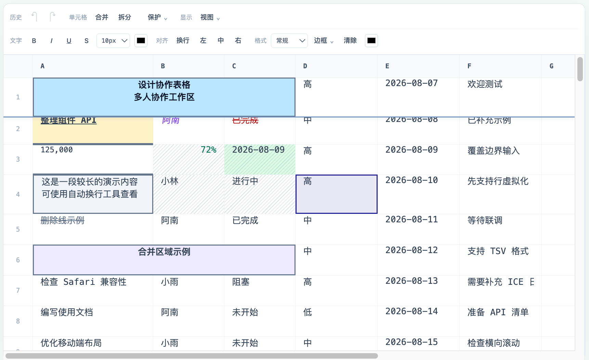

# Colwork

基于 Yjs 的多人协作表格前端库，使用原生 DOM 渲染，提供 Vue / React 演示页。

示例地址



## 开发

```sh
npm ci
npm run dev
```

- Vue：<http://127.0.0.1:5173/test/vue.html>
- 示例首页：<http://127.0.0.1:5173/>
- React：<http://127.0.0.1:5173/test/react.html>
- 快照与更新日志工具：<http://127.0.0.1:5173/test/index.html>

`npm run build` 执行 TypeScript 检查并构建 ES / UMD 库。

## Cloudflare 部署

使用两个独立 Worker，部署目标为：

| 服务 | Worker | 自定义域名 |
| --- | --- | --- |
| 前端 | `colwork-frontend` | `colwork.kuzuma.asia` |
| 后端 | `colwork-backend` | `api.colwork.kuzuma.asia` |

前端通过 Workers Static Assets 托管网站。`/api/*`、`/rooms/*` 和 `/health` 通过 `BACKEND` 服务绑定转发到后端，浏览器使用前端同源的 HTTPS/WSS，不需要配置跨域请求。后端自定义域名也提供 HTTP 接口和 WebSocket。

后端每个房间对应一个 SQLite Durable Object，处理 Yjs 同步、在线状态和文档持久化。每次更新保存完整 Yjs 状态，按 64 KiB 分块写入同一个 SQLite 事务；所有客户端离开或 Worker 重启后，内容、格式、合并、行列尺寸和锁定记录仍保留。在线状态只保存在连接附件中，断开后移除；固定范围继续是客户端本地状态。此版本适合现有演示规模，较大文档每次更新重写快照的开销需要后续优化。

### 首次部署

需要 Node.js 22 或更高版本，以及已将 `kuzuma.asia` 托管到 Cloudflare 的账号。SQLite Durable Objects 的套餐与用量以 [Cloudflare 官方说明](https://developers.cloudflare.com/durable-objects/platform/pricing/) 为准。

```sh
npm ci
npm run deploy
```

一条命令自动完成：检查 Git 忽略状态 → 缺少配置时从模板生成本地 `deploy.env` → 构建与类型检查 → 检查已有授权 → 必要时打开 Wrangler OAuth → 选择唯一账号 → 发布后端和前端、绑定域名 → 验证 HTTP、网站资产和 WSS 协作握手。首次 OAuth 仍需本人在浏览器中授权，后续部署复用授权。

本机已生成 `config/cloudflare/deploy.env` 时直接编辑，脚本保留现有内容并将文件权限设为仅当前用户读写。默认包含上述两个域名；如账号下有多个账户，在文件中设置 `CLOUDFLARE_ACCOUNT_ID`，脚本会在发布前停止，避免自动选错账号。可以运行 `npx wrangler whoami` 查看账号。

```sh
npm run deploy:check
npm run deploy
```

`deploy:check` 构建前端并检查两个 Worker 的打包结果，不请求登录、不发布、不创建线上存储，也不验证域名归属。`deploy` 先发布后端及 Durable Object 迁移，再发布前端并关联服务绑定，同时添加两个自定义域名。自定义域名需要属于当前账号的 Cloudflare Zone；已有同名 DNS 记录时，先核对其用途再处理冲突，见 [Custom Domains 文档](https://developers.cloudflare.com/workers/configuration/routing/custom-domains/)。

取消或拒绝 OAuth 会在发布任何 Worker 前终止。CI 或 `npm run deploy -- --no-login` 不会打开浏览器，缺少有效凭据时直接失败。域名刚绑定后，验证会短暂重试；超时会明确报告“已发布但验证失败”，不会报告部署成功，也不会自动删除或回滚房间存储。后端已发布而前端发布失败时，修正问题后重新运行同一命令即可。

自动化环境可通过环境变量提供 `CLOUDFLARE_API_TOKEN` 和 `CLOUDFLARE_ACCOUNT_ID`。Token 需要对目标账户部署 Workers、Durable Objects 和服务绑定的权限，以及目标 Zone 管理部署域名所需权限；不要提交 Token。环境变量优先于 `deploy.env`，也可通过 `CF_DEPLOY_CONFIG` 指定另一个配置文件。

OAuth 是 [Wrangler 的部署授权](https://developers.cloudflare.com/workers/wrangler/commands/general/)，不是表格应用的用户登录。凭据由 Wrangler 的用户凭据存储管理，脚本不读取或导出 Token。部署配置与结果只包含必要的 Worker 名称、账号 ID、域名和验证时间，不会序列化环境变量。账号 ID 和域名不属于认证秘密。

`.gitignore` 排除 `.wrangler/`（生成配置、部署结果、本地数据和日志）、`config/cloudflare/*.env`、`.env*`、`.dev.vars*`、`site-dist/`、`site-dist*.zip` 和 Worker 打包结果；无秘密的 `.example` 模板可提交。部署前检查这些路径是否已被 Git 跟踪，并检查项目内指定的配置文件是否确实被忽略；检查失败就停止部署。使用 `CF_DEPLOY_CONFIG` 指定项目内的新路径时，也必须先将其加入忽略规则。

如只想使用 `workers.dev`，将两个 `CF_*_CUSTOM_DOMAIN` 值留空。变更 Worker 名称时，脚本会同步更新前端服务绑定；已经有线上数据后应保持后端名称和 Durable Object 类名不变，避免连接到新的存储空间。

### 发布后检查

```sh
curl https://colwork.kuzuma.asia/health
curl https://api.colwork.kuzuma.asia/health
```

前端首页展示项目介绍、仓库地址、Vue / React 示例入口及引入配置代码。Vue 位于 `/test/vue.html`，React 位于 `/test/react.html`，两个示例页左上角可返回首页；离线快照工具位于 `/test/index.html`。Vue 和 React 均使用 `colwork-demo` 房间，可打开两个浏览器窗口验证内容、格式和锁定同步。关闭全部窗口再打开，验证持久化。密码锁定在 HTTPS 下可使用 Web Crypto。

部署脚本会自动检查两个域名的健康接口、前端首页资产引用和 WSS 的 Yjs 握手，WSS 检查不发送编辑。全部检查通过后，最后一次成功结果保存在被忽略的 `.wrangler/deploy-result.json`。

线上版本使用 WebSocket，不启动原有 Node 服务，不依赖本机 1234/4444 端口；`?transport=webrtc` 不会切换线上传输方式。本地 `npm run dev` 仍保留原有 WebRTC 实验方式。

### 本地运行与测试

```sh
npm run dev:cloudflare
```

Wrangler 本地运行网站、Worker 和 Durable Objects，默认地址为 `http://localhost:8787`，持久化目录为 `.wrangler/state`。删除此目录会清空本地数据，不影响线上数据。

```sh
npm run build:site
npx playwright install chromium
npm run test:cloudflare
npm run test:e2e
```

Cloudflare 测试在真实本地 Workers 运行时中启动两个独立 Worker，验证 HTTP、服务绑定、WebSocket、房间隔离、在线状态、Vue/React 协作、清空后刷新及超过 128 KiB 文档的重启恢复。测试使用临时目录，不影响开发或线上数据。可设置 `PLAYWRIGHT_CHROMIUM_EXECUTABLE_PATH` 使用本机 Chrome。

同一测试命令也运行部署流程测试：通过模拟 Cloudflare CLI 验证自动 OAuth、取消授权、CI、账号选择、发布顺序、Git 跟踪检查及 Token 不落入生成配置。这些流程测试不请求实际 OAuth、不发布线上 Worker。

### 代码入口

- `vite.site.config.ts`：部署网站构建，与 ES/UMD 库构建分开。
- `server/cloudflare/frontend.mjs`：静态资产与同源代理。
- `server/cloudflare/backend.mjs`：请求路由、房间 Durable Object、SQLite 持久化。
- `server/cloudflare/protocol.mjs`：Yjs 二进制同步协议及在线状态。
- `config/cloudflare/wrangler.*.json`：前端、后端及本地单 Worker 配置。
- `script/deploy-cloudflare.mjs`：读取配置、构建、按顺序部署并绑定域名。
- `test/user-settings.ts`：部署版本使用同源 API 与 WSS。

有持久化后端时，`ColworkTable` 使用 `initializeAfterSync: true`：先接收服务端状态，再为尚未初始化的空房间填入示例数据，初始化标记随文档保存，已清空的房间不会在刷新时重新填入示例。WebSocket URL 的查询参数独立传给 Provider，房间名编码后作为路径，避免查询参数与房间路径拼接错误。

部署沿用现有演示的公开房间模型。密码锁定是客户端防误改，服务端未新增账号权限或内容加密，详情见下方「固定与锁定」说明。

实现参考了 csBoard 的双 Worker 架构，协议模块按 Colwork 的 Yjs 客户端独立实现。平台接口参见 [WebSocket Hibernation](https://developers.cloudflare.com/durable-objects/best-practices/websockets/)、[SQLite Storage API](https://developers.cloudflare.com/durable-objects/api/sqlite-storage-api/) 和 [Static Assets Binding](https://developers.cloudflare.com/workers/static-assets/binding/)。

## 工具栏与菜单

工具栏按用途分为两排：上排是历史、单元格、保护和显示，下排是文字、对齐和格式；窄屏按组换行。右键菜单按编辑/行列操作、固定、保护分组，支持方向键移动、Enter 执行和 Esc 关闭，窗口空间不足时菜单内部滚动。

固定行的下边缘、固定列的右边缘显示分隔线和轻阴影；即使隐藏网格线，固定边界仍然可见，取消固定后消失。

## 行列选择

按住鼠标左键拖过行号或列字母，可连续选择整行或整列，支持反向拖动；松开鼠标结束。选中的行列头会高亮，仍支持 Shift 点击扩选。拖动期间可滚动视口继续选择，选区在松开鼠标后同步给协作者。

## 固定与锁定

- **固定**：选中单元格或行列，在「视图」或右键菜单中选择「固定至选中行/列」。从首行/首列固定到选区末端，可同时固定两个方向；「取消固定」恢复滚动。此设置仅影响当前客户端，不写入快照。所选行列集合或固定边界包含不完整的合并块时，会提示并拒绝固定，原固定范围保持不变。合并范围同时包含固定区和非固定区时，也会提示并拒绝合并。
- **锁定**：选中区域后打开工具栏「保护」菜单，统一选择「锁定选区」「密码锁定选区」或「解锁选区」，右键菜单也提供相同操作。密码锁定，需要输入两次密码；解锁密码区域时会弹出密码校验。普通锁定和密码锁定均显示相同的透明斜线遮罩，保留内容和格式可见，状态同步给协作者，随快照和更新日志保存。锁定覆盖选区当时的单元格，不自动覆盖以后新增的行列。
- 选区包含锁定单元格时，清空、格式、合并/拆分操作整体拒绝；粘贴目标包含锁定单元格时，整次粘贴拒绝。会移动或删除锁定单元格的行列操作，以及涉及锁定单元格的行高列宽调整也被拒绝。
- 锁定/解锁发生变化时清空当前客户端的撤销历史，避免旧操作改写锁定内容。远端锁定编辑中的单元格时，丢弃尚未提交的输入。
- 无密码锁定可直接解锁；密码锁定必须通过密码验证，普通锁定不能覆盖密码锁。混合选区需同一密码验证所有保护记录，否则整次解锁不生效，不同密码的区域应分别解锁。
- 密码采用 Web Crypto PBKDF2-HMAC-SHA-256（600,000 次迭代），每次密码锁定生成随机 16 字节盐，保存 32 字节派生验证值和版本参数，不保存明文密码。参数参考 [OWASP Password Storage Cheat Sheet](https://cheatsheetseries.owasp.org/cheatsheets/Password_Storage_Cheat_Sheet.html)。需要 HTTPS 或 localhost；密码无法通过界面找回。
- 密码保护仍属于客户端协作防误改，不是服务端鉴权，也没有加密表格内容。旧客户端或直接修改 Yjs 的代码仍可能绕过保护；存档包含盐和验证值，应避免使用弱密码。

实例 API：

```ts
table.setFrozenPanes(1, 2)       // 固定前 1 行、前 2 列；若切开合并块则返回 false
table.setFrozenPanes(0, 0)       // 取消固定
await table.setSelectionLocked(true)                // 无密码锁定当前选区
await table.setSelectionLocked(true, 'your-password') // 密码锁定（选区不能已有密码锁）
await table.setSelectionLocked(false, 'your-password') // 验证密码并解锁
await table.setSelectionLocked(false)               // 解锁无密码区域
```

`setFrozenPanes()` 成功返回 `true`；合并块不完整时返回 `false` 并显示提示。固定是本地视图设置，其他客户端的合并若与本地固定边界冲突，会提示并取消受影响方向的固定。

`setSelectionLocked()` 现在返回 Promise；密码错误、保护记录无效、校验期间文档改变时会拒绝 Promise，调用方需捕获错误。取消密码对话框不会修改锁定状态；处理期间禁用重复提交和取消。

## 浏览器测试

```sh
npx playwright install chromium
npm run test:e2e
```

测试自动启动独立的 Vite 和临时 WebSocket 服务，覆盖固定、锁定、跨客户端同步和存档恢复。也可通过 `PLAYWRIGHT_CHROMIUM_EXECUTABLE_PATH` 指定本机 Chrome 可执行文件。

## License

本项目采用 [MIT License](LICENSE)，版权归属 © 2026 dlwm。
